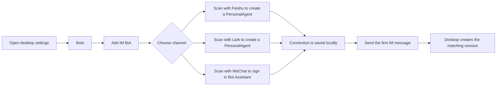
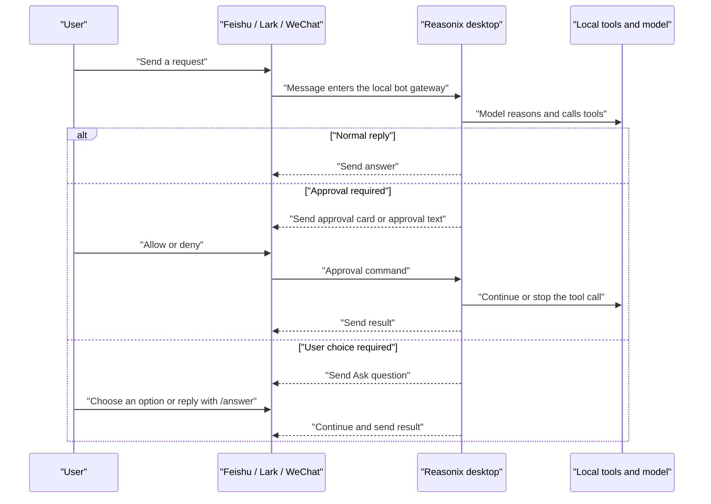
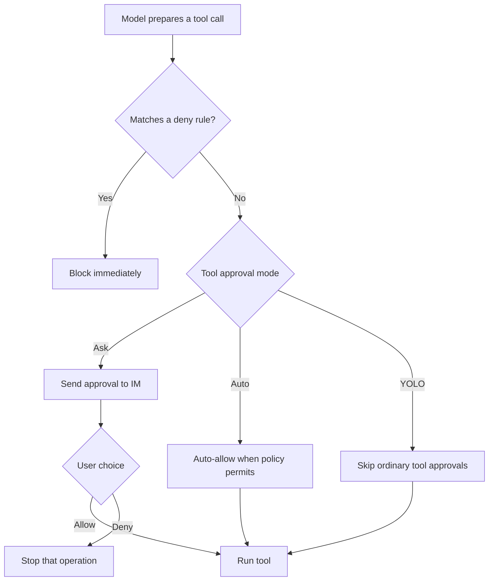

# Reasonix Bot Guide

<a href="../README.md">README</a>
&nbsp;·&nbsp;
<a href="./BOT_GUIDE.zh-CN.md">简体中文</a>
&nbsp;·&nbsp;
<a href="./GUIDE.md">General guide</a>

> For desktop users. This guide explains how to connect Feishu, Lark, and WeChat
> bots, how to use Reasonix from IM, and how approvals, Ask questions, YOLO, and
> bot commands work.

## Contents

- [What the bot does](#what-the-bot-does)
- [Connect the three channels](#connect-the-three-channels)
- [Run the bot headlessly](#run-the-bot-headlessly)
- [Usage flow](#usage-flow)
- [Channel interaction differences](#channel-interaction-differences)
- [Command quick reference](#command-quick-reference)
- [Approvals and YOLO](#approvals-and-yolo)
- [Do upgrades require rebinding?](#do-upgrades-require-rebinding)
- [Troubleshooting](#troubleshooting)

## What the bot does

After a bot is connected, you can send Reasonix messages from Feishu, Lark, or
WeChat. The desktop app handles the model, tools, permissions, sandboxing, and
local context, then sends progress and results back to the IM channel.

Common uses:

- Ask Reasonix to inspect code, read docs, explain errors, or summarize findings.
- Trigger tool calls from IM and receive progress or final results in the chat.
- Approve or deny sensitive actions such as file writes or shell commands.
- Enable YOLO for trusted temporary work so ordinary tool approvals are skipped.
- Open the matching desktop IM session to inspect context, cost, tokens, and tool
  traces.

## Connect the three channels

Open the Reasonix desktop app and go to **Settings -> Bots**. In **Add IM Bot**,
choose a channel and scan the QR code.



### Feishu

1. In **Settings -> Bots -> Add IM Bot**, choose **Feishu**.
2. Generate a QR code.
3. Scan it with Feishu and finish authorization.
4. Wait until the page shows the connection as connected.
5. Send the bot a message such as `hello` or `please inspect this error`.

### Lark

1. In **Settings -> Bots -> Add IM Bot**, choose **Lark**.
2. Generate a QR code.
3. Scan it with Lark and finish authorization.
4. Wait until the page shows the connection as connected.
5. Send the Lark bot a message.

Feishu and Lark share the same capability set, but they are saved as separate
connections. You can give them different models, working directories, or tool
approval modes.

### WeChat

1. In **Settings -> Bots -> Add IM Bot**, choose **WeChat**.
2. Generate a QR code.
3. Scan it with WeChat to sign in to Bot Assistant.
4. Wait until the page shows the connection as connected.
5. Send the WeChat bot a message.

WeChat does not provide interactive card buttons here, so approvals and Ask
questions are handled through text commands.

## Run the bot headlessly

The desktop app is the easiest way to create and test bot connections, but the
runtime itself can also run as a long-lived headless gateway:

```sh
reasonix bot doctor
reasonix bot start --channels feishu,lark,weixin --dir /path/to/project
```

Use `--channels` to choose which configured IM inputs to accept. `feishu` and
`lark` select the matching Feishu-family connection; `weixin` selects the saved
WeChat iLink account; `qq` selects the configured QQ bot. Use `--dir` to attach
incoming messages to a project workspace and `--model` to override the default
model for this process.

The headless gateway uses the same config records as the desktop app:

- `[[bot.connections]]` identifies each IM input. `provider` is the adapter
  family (`feishu`, `weixin`, or `qq`), while `domain` distinguishes variants
  such as Feishu vs Lark.
- `credential.app_id`, `credential.app_secret_env`, `credential.account_id`,
  and `credential.token_env` point to app IDs, app secrets, saved accounts, and
  tokens. Secrets stay in environment variables or the Reasonix user credentials
  store.
- `workspace_root`, `model`, and `tool_approval_mode` can be set per
  connection. This lets different IM channels route to different local projects
  or approval postures.
- `session_mappings` are filled from inbound messages with the remote chat ID
  and scope. The desktop UI can open the matching conversation once the mapping
  also has a local `session_id` target, such as a saved `path:` session target
  from a desktop-managed bot runtime or a manually configured mapping.

Access control is still mandatory. Either enable an allowlist under
`[bot.allowlist]` with at least one relevant platform user ID, or set
`allow_all = true` deliberately. Group IDs are optional additional scoping for
group chats; they do not replace the required user allowlist. Remote users go
through the same controller, permission policy, tool approval mode, and sandbox
rules as local desktop or CLI turns.

## Usage flow



The **Bots** entry in the desktop sidebar lists connected bots. After the first
IM message arrives, you can open the matching local session from there to inspect
context, tool traces, cost, and runtime metrics.

## Channel interaction differences

The following images are synthetic examples. They show the interaction shape
without exposing real account IDs, local paths, or private chat content.


| Channel | Connection | Approval | Ask questions | Best for |
| --- | --- | --- | --- | --- |
| Feishu | Scan to create a PersonalAgent | Interactive card buttons, or commands | Interactive card buttons, or commands | Feishu workspaces, DMs, and groups |
| Lark | Scan to create a PersonalAgent | Interactive card buttons, or commands | Interactive card buttons, or commands | International Lark workspaces |
| WeChat | Scan with WeChat | Reply `1` / `2`, or commands | Single-choice questions can use a number, or commands | Lightweight personal/mobile testing |

Feishu and Lark card buttons are converted into commands such as
`/approve <id>`, `/deny <id>`, or `/answer <id> <option>`. If a button expires
or the platform reports a card action failure, copy the ID shown in the card and
send the equivalent text command.

## Command quick reference

These commands work in Feishu, Lark, and WeChat.

| Command | Purpose | Example |
| --- | --- | --- |
| `/help` | Show available commands | `/help` |
| `/status` | Show active tasks, retained sessions, and tool approval mode | `/status` |
| `/stop` | Stop the current task | `/stop` |
| `/new` | Start a fresh session | `/new` |
| `/reset` | Reset the current session | `/reset` |
| `/approve <id>` | Approve a pending operation | `/approve 1` |
| `/deny <id>` | Deny a pending operation | `/deny 1` |
| `/answer <id> <option>` | Answer an Ask question | `/answer ask-1 2` |
| `/yolo` | Enable YOLO | `/yolo` |
| `/yolo on` | Enable YOLO | `/yolo on` |
| `/yolo off` | Return to Ask mode | `/yolo off` |
| `/yolo auto` | Switch to Auto approval mode | `/yolo auto` |
| `/yolo status` | Show the current tool approval mode | `/yolo status` |
| `/mode yolo` | Switch to YOLO | `/mode yolo` |
| `/mode ask` | Switch to Ask mode | `/mode ask` |
| `/mode auto` | Switch to Auto mode | `/mode auto` |

Shortcut replies:

- When an approval is pending, reply `1` to approve and `2` to deny.
- When a single-choice Ask question is pending, reply with the option number.
- If there is no pending operation, `1` / `2` are treated as normal text or
  produce guidance.

## Approvals and YOLO

Reasonix bots use the same permission system as the desktop app. Ask mode is the
default: sensitive tool calls such as file writes and shell commands request
confirmation first.



YOLO boundaries:

- YOLO skips ordinary tool approval prompts.
- YOLO does not bypass hard `deny` rules.
- YOLO does not answer model Ask questions for you.
- YOLO does not approve plan-mode plan approvals for you.

Recommendations:

- Use `/yolo` for temporary trusted debugging or fast local iteration.
- Use `/mode ask` for risky work, production code, or anything uncertain.
- Use `/mode auto` when you want fewer routine prompts while keeping policy
  decisions.

## Do upgrades require rebinding?

No. A normal Reasonix app upgrade or overwrite install does not require
rebinding.

Bindings are stored in the user's Reasonix data, not inside the app bundle:

- Bot connections, remote IDs, allowlists, model choices, and approval modes are
  stored in the user config.
- Feishu and Lark secrets are stored in the Reasonix user credentials file.
- The WeChat scanned account token is stored in the Reasonix user data
  directory.

You may need to bind again if:

- The Reasonix user config directory was deleted.
- You changed machines or OS users.
- Authorization was revoked on the platform side.
- The WeChat token expired.
- Feishu or Lark app secrets were cleared.

## Troubleshooting

| Symptom | What to check |
| --- | --- |
| QR code says the link expired | Generate a new QR code in Settings; QR codes expire. |
| Connected but no reply | Make sure the Reasonix desktop app is running, the bot connection is enabled, and the sender ID is allowlisted or access is open. |
| Feishu or Lark button action fails | Send the text command from the card, such as `/approve <id>` or `/deny <id>`. |
| WeChat reply `1` does nothing | Numeric shortcuts only work when an approval or single-choice Ask is pending; use the full command if needed. |
| Need to confirm the current mode | Send `/status` or `/yolo status`. |
| Need a fresh context | Send `/new` or `/reset`. |
| Need to stop the current task | Send `/stop`. |

If connectivity still fails, open the connection's advanced settings in
**Settings -> Bots** and use the configuration check, test send, and runtime
settings to locate the issue.
