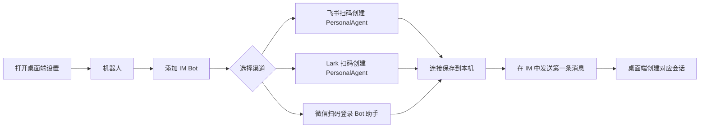
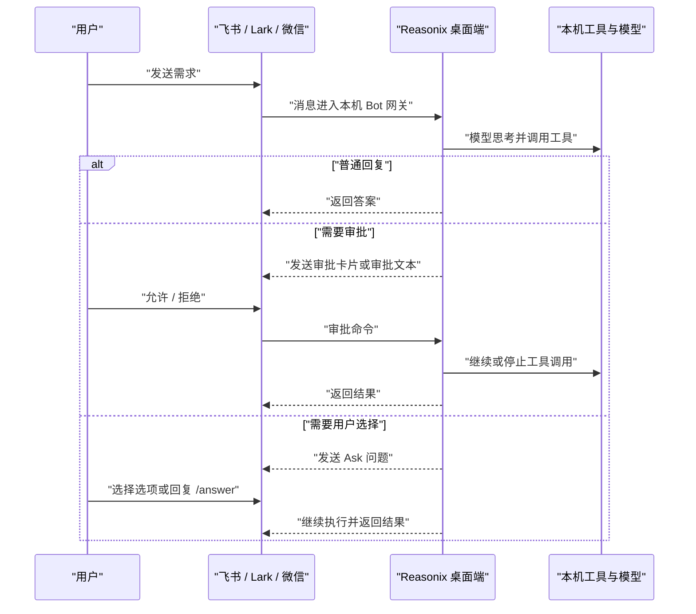
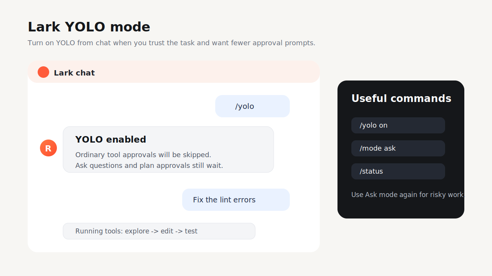
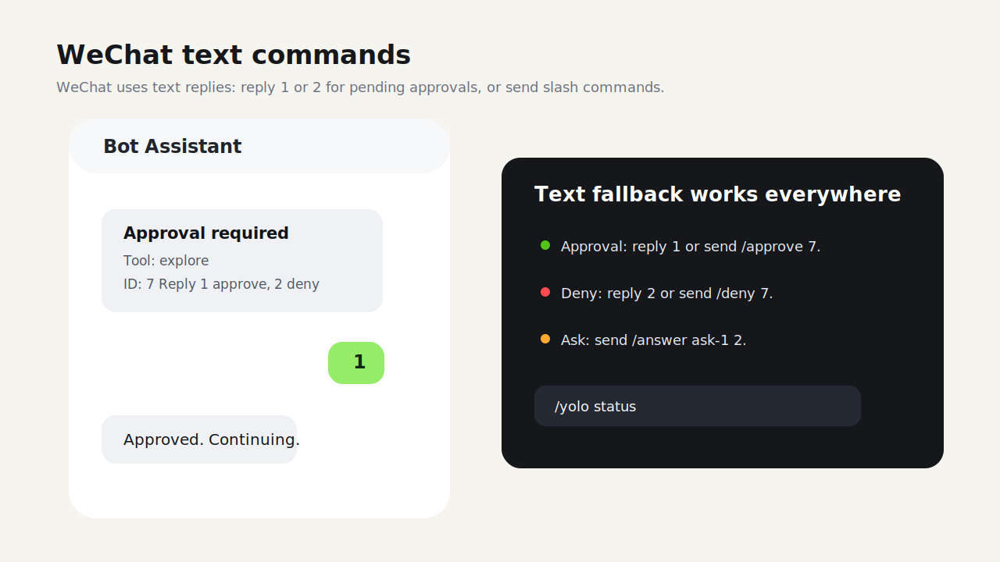
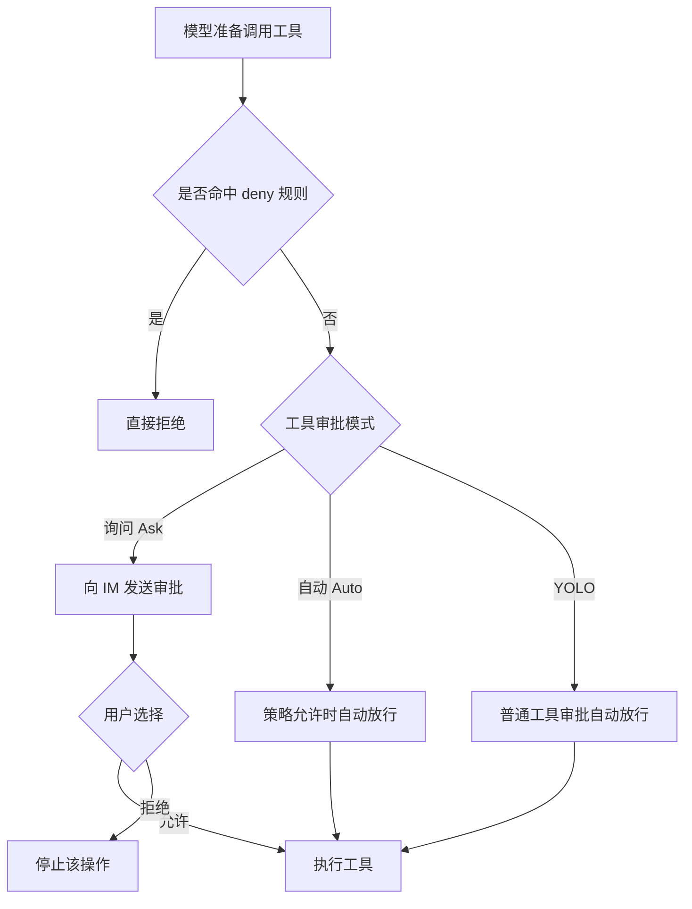

# Reasonix 机器人使用指南

<a href="../README.zh-CN.md">README</a>
&nbsp;·&nbsp;
<a href="./BOT_GUIDE.md">English</a>
&nbsp;·&nbsp;
<a href="./GUIDE.zh-CN.md">通用指南</a>

> 面向桌面端用户。本文说明如何连接飞书、Lark 和微信机器人，如何在 IM
> 里使用 Reasonix，以及审批、问答、YOLO 和常用命令的交互方式。

## 目录

- [能做什么](#能做什么)
- [连接三个渠道](#连接三个渠道)
- [无界面运行 Bot](#无界面运行-bot)
- [使用流程](#使用流程)
- [三种渠道的交互差异](#三种渠道的交互差异)
- [命令速查](#命令速查)
- [审批与 YOLO](#审批与-yolo)
- [升级后是否需要重新绑定](#升级后是否需要重新绑定)
- [排障](#排障)

## 能做什么

连接机器人后，你可以在飞书、Lark 或微信里给 Reasonix 发消息，让桌面端
Reasonix 在本机执行同一套模型、工具、权限与沙盒逻辑。

典型场景：

- 让 Reasonix 查代码、读文档、解释错误、整理结论。
- 在 IM 中触发工具调用，并把执行过程和结果回传到聊天窗口。
- 遇到写文件、执行命令等敏感操作时，在 IM 中审批或拒绝。
- 对临时测试任务开启 YOLO，跳过普通工具审批。
- 打开桌面端对应 IM 会话，继续查看上下文、成本、tokens 和工具轨迹。

## 连接三个渠道

打开桌面端 Reasonix，进入 **设置 -> 机器人**。在 **添加 IM Bot** 区域选择
渠道并扫码。



### 飞书

1. 在 **设置 -> 机器人 -> 添加 IM Bot** 里选择 **飞书**。
2. 点击生成二维码。
3. 用飞书扫码并完成授权。
4. 等待页面显示已连接。
5. 给飞书 Bot 发送消息，例如 `你好` 或 `帮我看一下这个报错`。

### Lark

1. 在 **设置 -> 机器人 -> 添加 IM Bot** 里选择 **Lark**。
2. 点击生成二维码。
3. 用 Lark 扫码并完成授权。
4. 等待页面显示已连接。
5. 给 Lark Bot 发送消息。

飞书和 Lark 使用同一套能力，但作为两个独立连接保存。你可以给它们设置不同
模型、工作目录或工具审批模式。

### 微信

1. 在 **设置 -> 机器人 -> 添加 IM Bot** 里选择 **微信**。
2. 点击生成二维码。
3. 用微信扫码登录 Bot 助手。
4. 等待页面显示已连接。
5. 给微信 Bot 发送消息。

微信没有交互卡片按钮，因此审批和问答主要通过文字命令完成。

## 无界面运行 Bot

桌面端是创建和测试 Bot 连接最简单的入口，但 Bot 运行时也可以作为长期运行的
无界面网关启动：

```sh
reasonix bot doctor
reasonix bot start --channels feishu,lark,weixin --dir /path/to/project
```

`--channels` 用来选择接受哪些已配置的 IM 输入。`feishu` 和 `lark` 会选择对应
飞书系连接，`weixin` 会选择已保存的微信 iLink 账号，`qq` 会选择已配置的 QQ
Bot。`--dir` 用来把远端消息绑定到某个项目工作区，`--model` 可以为这个进程
临时覆盖默认模型。

无界面网关复用桌面端保存的同一套配置：

- `[[bot.connections]]` 标识每个 IM 输入。`provider` 是适配器类型
  （`feishu`、`weixin` 或 `qq`），`domain` 用来区分飞书和 Lark 等变体。
- `credential.app_id`、`credential.app_secret_env`、`credential.account_id`
  和 `credential.token_env` 指向应用 ID、应用密钥、保存的账号或 token。
  密钥仍保存在环境变量或 Reasonix 用户凭据中。
- `workspace_root`、`model` 和 `tool_approval_mode` 可以按连接单独设置，
  因此不同 IM 渠道可以路由到不同本地项目或审批模式。
- `session_mappings` 会根据收到的远端消息自动填充远端 chat ID 和作用域。
  只有当该映射同时具备本地 `session_id` 目标时，桌面端才能打开对应会话；
  例如桌面端托管的 Bot runtime 保存了 `path:` 会话目标，或用户手动配置了
  映射目标。

访问控制仍然是必需项。你需要在 `[bot.allowlist]` 下为对应平台至少配置一个
用户 ID，或者有意设置 `allow_all = true`。群 ID 是群聊里的额外收窄条件，
不能替代用户白名单。远端用户进入的是同一个 Reasonix controller、权限策略、
工具审批模式和沙盒边界，和本地桌面端或 CLI 回合一致。

## 使用流程



桌面端左侧的 **机器人** 入口会显示已连接 Bot。收到第一条 IM 消息后，可以
从这里打开对应本地会话，查看上下文、工具轨迹、成本和运行指标。

## 三种渠道的交互差异

下面三张图是虚构内容的交互示意，用来帮助理解真实软件里的操作形态。






| 渠道 | 连接方式 | 审批方式 | Ask 问答 | 适合场景 |
| --- | --- | --- | --- | --- |
| 飞书 | 扫码创建 PersonalAgent | 交互卡片按钮，也可用命令 | 交互卡片按钮，也可用命令 | 国内飞书工作流、群聊或个人助手 |
| Lark | 扫码创建 PersonalAgent | 交互卡片按钮，也可用命令 | 交互卡片按钮，也可用命令 | 国际版 Lark 工作流 |
| 微信 | 微信扫码登录 | 回复 `1` / `2` 或命令 | 单选可直接回复编号，也可用命令 | 微信个人测试、轻量移动触发 |

飞书和 Lark 的卡片按钮会在后台转换为命令，例如 `/approve <id>`、
`/deny <id>` 或 `/answer <id> <选项>`。如果按钮过期或平台提示操作失败，
可以直接复制卡片里的 ID，用文字命令继续。

## 命令速查

这些命令在飞书、Lark 和微信中通用。

| 命令 | 作用 | 示例 |
| --- | --- | --- |
| `/help` | 查看可用命令 | `/help` |
| `/status` | 查看活跃任务、保留会话数和工具审批模式 | `/status` |
| `/stop` | 停止当前任务 | `/stop` |
| `/new` | 开始新会话 | `/new` |
| `/reset` | 重置当前会话 | `/reset` |
| `/approve <id>` | 批准待审批操作 | `/approve 1` |
| `/deny <id>` | 拒绝待审批操作 | `/deny 1` |
| `/answer <id> <选项>` | 回答 Ask 问题 | `/answer ask-1 2` |
| `/yolo` | 开启 YOLO | `/yolo` |
| `/yolo on` | 开启 YOLO | `/yolo on` |
| `/yolo off` | 切回询问模式 | `/yolo off` |
| `/yolo auto` | 切换到自动审批模式 | `/yolo auto` |
| `/yolo status` | 查看当前工具审批模式 | `/yolo status` |
| `/mode yolo` | 切换到 YOLO | `/mode yolo` |
| `/mode ask` | 切换到询问模式 | `/mode ask` |
| `/mode auto` | 切换到自动模式 | `/mode auto` |

快捷回复：

- 有待审批操作时，回复 `1` 表示批准，回复 `2` 表示拒绝。
- 有单选 Ask 问题时，可以直接回复选项编号。
- 如果没有待处理操作，`1` / `2` 会被当作普通消息或收到提示。

## 审批与 YOLO

Reasonix 的机器人沿用桌面端权限系统。默认是询问模式：写文件、执行命令等
敏感工具调用会先请求确认。



YOLO 的边界很重要：

- YOLO 会跳过普通工具审批。
- YOLO 不会跳过硬性 `deny` 规则。
- YOLO 不会自动回答模型提出的 Ask 问题。
- YOLO 不会自动批准计划模式里的计划批准。

建议：

- 临时调试、可信项目、需要快速连续读写时，可以用 `/yolo`。
- 做高风险操作、生产代码或不确定任务时，用 `/mode ask` 切回询问模式。
- 想减少普通审批但保留策略判断时，用 `/mode auto`。

## 升级后是否需要重新绑定

正常升级或覆盖安装 Reasonix app 后，不需要重新绑定。

绑定信息保存在用户配置目录，而不是 app 包内：

- Bot 连接、远端 ID、白名单、模型和审批模式保存在用户配置文件。
- 飞书和 Lark 的密钥保存在 CLI 与桌面端共用的 Reasonix 全局
  `<Reasonix home>/.env`。
- 微信扫码后的账号 token 保存在 Reasonix 的用户数据目录。

需要重新扫码的情况：

- 删除了 Reasonix 用户配置目录。
- 换了 macOS 用户或换了机器。
- 平台侧撤销授权。
- 微信 token 失效。
- 飞书或 Lark 应用密钥被清除。

## 排障

| 现象 | 可以检查 |
| --- | --- |
| 扫码提示链接失效 | 回到设置页重新生成二维码；二维码有有效期。 |
| 已连接但没有回复 | 确认桌面端 Reasonix 正在运行，Bot 连接已开启，用户 ID 在白名单内或允许所有人。 |
| 飞书或 Lark 按钮提示失败 | 直接发送卡片里的命令，例如 `/approve <id>` 或 `/deny <id>`。 |
| 微信回复 `1` 没反应 | 只有存在待审批或单选 Ask 时数字快捷回复才生效；也可以使用完整命令。 |
| 想确认当前模式 | 发送 `/status` 或 `/yolo status`。 |
| 想重新开始上下文 | 发送 `/new` 或 `/reset`。 |
| 想停止当前任务 | 发送 `/stop`。 |

如果仍然无法连通，可以在 **设置 -> 机器人** 中打开对应 Bot 的高级设置，使用
检查配置、测试发送和运行设置来定位问题。
