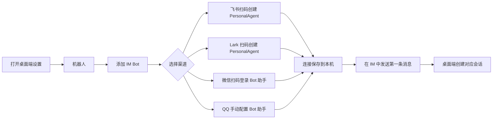
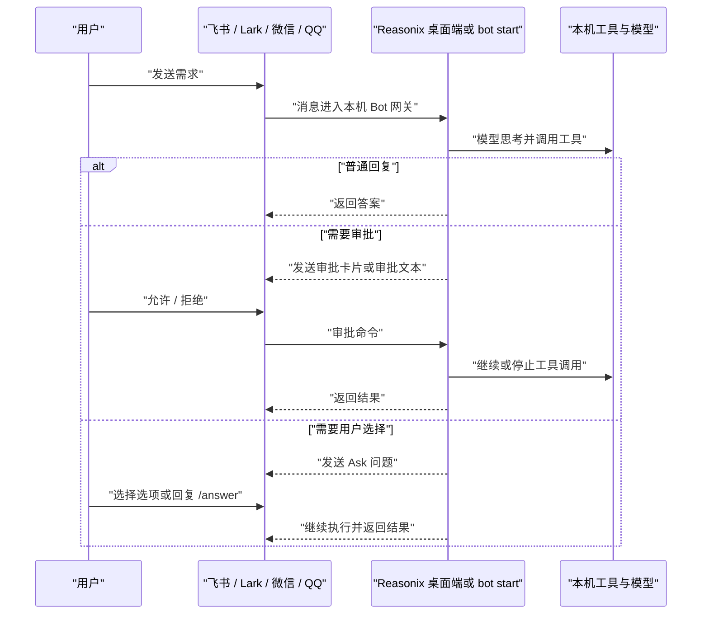
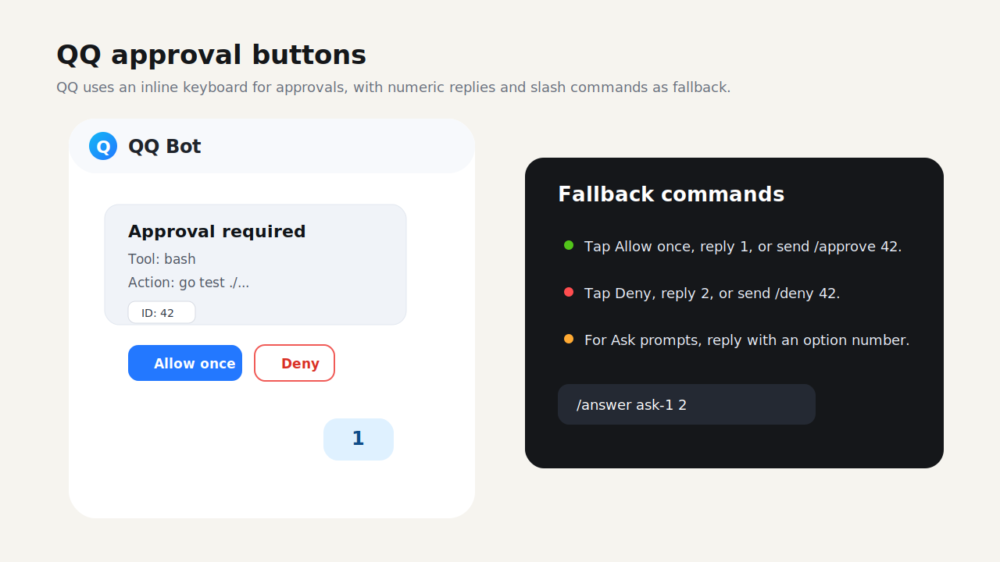
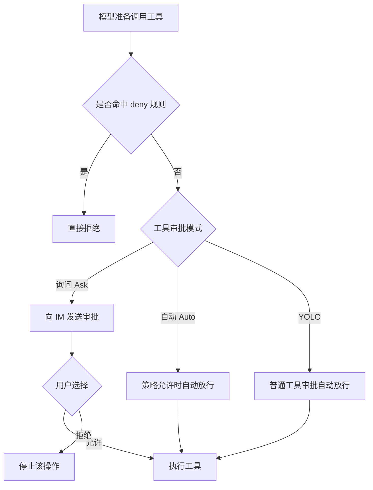

# Reasonix 机器人使用指南

<a href="../README.zh-CN.md">README</a>
&nbsp;·&nbsp;
<a href="./BOT_GUIDE.md">English</a>
&nbsp;·&nbsp;
<a href="./GUIDE.zh-CN.md">通用指南</a>

> 面向桌面端和 CLI 用户。本文说明如何连接飞书、Lark、微信和 QQ 机器人，
> 如何在 IM 里使用 Reasonix，以及审批、问答、YOLO 和常用命令的交互方式。

## 目录

- [能做什么](#能做什么)
- [在哪里运行](#在哪里运行)
- [连接四个渠道](#连接四个渠道)
- [无界面运行 Bot](#无界面运行-bot)
- [使用流程](#使用流程)
- [四种渠道的交互差异](#四种渠道的交互差异)
- [命令速查](#命令速查)
- [审批与 YOLO](#审批与-yolo)
- [升级后是否需要重新绑定](#升级后是否需要重新绑定)
- [排障](#排障)

## 能做什么

连接机器人后，你可以在飞书、Lark、微信或 QQ 里给 Reasonix 发消息，让桌面端
Reasonix 或 `reasonix bot start` 进程在本机执行同一套模型、工具、权限与
沙盒逻辑。

典型场景：

- 让 Reasonix 查代码、读文档、解释错误、整理结论。
- 在 IM 中触发工具调用，并把执行过程和结果回传到聊天窗口。
- 遇到写文件、执行命令等敏感操作时，在 IM 中审批或拒绝。
- 对临时测试任务开启 YOLO，跳过普通工具审批。
- 打开桌面端对应 IM 会话，继续查看上下文、成本、tokens 和工具轨迹。

## 在哪里运行

Bot gateway 是一套共享的 Go runtime。核心行为在 Windows、macOS 和 Linux
上都生效；实际差异主要来自各 IM 平台的凭据、网络、回调或 WebSocket 配置，
以及本机保存的账号状态。

目前有两个入口：

- **桌面端 runtime**：在 **设置 -> 机器人** 中配置。桌面端会启动 gateway，
  在应用内维护状态，持久化每个连接的工具审批模式变化，并允许打开匹配的
  本地 IM 会话。
- **CLI runtime**：执行 `reasonix bot start` 启动无界面长期进程。它复用
  与桌面端相同的配置、白名单、路由、队列设置、配对存储、适配器和
  项目/会话索引。

普通 `reasonix run` 不会自动启动 IM 网关。只有桌面端 bot runtime 正在运行，
或存在一个存活的 `reasonix bot start` 进程时，远端 IM bot 能力才会生效。

## 连接四个渠道

打开桌面端 Reasonix，进入 **设置 -> 机器人**。在 **添加 IM Bot** 区域选择
渠道并扫码。



### 飞书

1. 在 **设置 -> 机器人 -> 添加 IM Bot** 里选择 **飞书**。
2. 点击生成二维码。
3. 用飞书扫码并完成授权。
4. 等待页面显示已连接。
5. 给飞书 Bot 发送消息，例如 `你好` 或 `帮我看一下这个报错`。

### Lark

1. 在 **设置 -> 机器人 -> 添加 IM Bot** 里选择 **Lark**。
2. 点击生成二维码。
3. 用 Lark 扫码并完成授权。
4. 等待页面显示已连接。
5. 给 Lark Bot 发送消息。

飞书和 Lark 使用同一套能力，但作为两个独立连接保存。你可以给它们设置不同
模型、工作目录或工具审批模式。Bot 文本回复会以独立 Interactive Card JSON
2.0 markdown 发送，避免飞书/Lark 平台级引用前缀，同时保留 CommonMark
格式；如果卡片超过平台限制，Reasonix 会自动降级为纯文本。

Webhook 模式需要配置 verification token。传入事件会 fail-closed 校验：如果
配置中的 token 为空或缺失，调用方会被拒绝，不会静默开放 webhook。

### 微信

1. 在 **设置 -> 机器人 -> 添加 IM Bot** 里选择 **微信**。
2. 点击生成二维码。
3. 用微信扫码登录 Bot 助手。
4. 等待页面显示已连接。
5. 给微信 Bot 发送消息。

微信没有交互卡片按钮，因此审批通过数字或文字命令完成。Ask 问题可以直接
回复普通文本、选项编号，或使用 `/answer <id> <回答>`。

### QQ

1. 在 **设置 -> 机器人 -> 添加 IM Bot** 里选择 **QQ**。
2. 填写 **App ID** 和 **App Secret**（或设置环境变量 `QQ_BOT_APP_SECRET`）。
3. 点击 **保存** 存储凭据。
4. 等待页面显示已连接。
5. 给 QQ Bot 发送消息。

QQ Bot 使用官方 QQ Bot 平台 API。它支持内联键盘按钮来完成审批。
Ask 问答会以文字形式发送；可以直接回复普通文本、选项编号，或使用
`/answer <id> <回答>`。当按钮过期或平台提示操作失败时，可以直接复制
卡片里的 ID，用文字命令继续。

QQ 不支持扫码连接，必须手动配置 App ID 和 App Secret。适配器只读取配置的
`app_secret_env`，不会再回退读取无关的 `QQ_SECRET` 环境变量。QQ 和微信的
HTTP 调用使用带超时的 client，避免平台请求卡住后无限阻塞 gateway。

## 无界面运行 Bot

桌面端是创建和测试 Bot 连接最简单的入口，但 Bot 运行时也可以作为长期运行的
无界面网关启动：

```sh
reasonix bot doctor
reasonix bot doctor --deep
reasonix bot start --channels qq,feishu,lark,weixin --dir /path/to/project
```

`--channels` 用来选择接受哪些已配置的 IM 输入。`feishu` 和 `lark` 会选择对应
飞书系连接，`weixin` 会选择已保存的微信 iLink 账号，`qq` 会选择已配置的 QQ
Bot。`--dir` 用来把远端消息绑定到某个项目工作区，`--model` 可以为这个进程
临时覆盖默认模型。

无界面网关复用桌面端保存的同一套配置：

- `[[bot.connections]]` 标识每个 IM 输入。`provider` 是适配器类型
  （`feishu`、`weixin` 或 `qq`），`domain` 用来区分飞书和 Lark 等变体。
- `credential.app_id`、`credential.app_secret_env`、`credential.account_id`
  和 `credential.token_env` 指向应用 ID、应用密钥、保存的账号或 token。
  密钥仍保存在环境变量或 Reasonix 用户凭据中。
- `workspace_root`、`model` 和 `tool_approval_mode` 可以按连接单独设置，
  因此不同 IM 渠道可以路由到不同本地项目或审批模式。
- `access` 也可以按连接单独设置，包括 `enabled`、`allow_all`、
  `pairing_enabled`、`users`、`groups`、`admins` 和 `approvers`。当某个连接
  有启用中的 access 配置时，会优先检查该连接自己的访问控制，再退回旧的全局
  `[bot.allowlist]`。
- `[[bot.routes]]` 可以继续按远端连接、平台、会话类型、chat ID、用户 ID
  或 thread ID 做更细粒度路由；空匹配字段表示通配，按配置顺序第一个命中。
  命中后可覆盖 `workspace_root`、`model` 和 `tool_approval_mode`。
- `session_mappings` 会根据收到的远端消息自动填充远端 chat ID 和作用域。
  只有当该映射同时具备本地 `session_id` 目标时，桌面端才能打开对应会话；
  例如桌面端托管的 Bot runtime 保存了 `path:` 会话目标，或用户手动配置了
  映射目标。
- Bot 的项目/会话索引只来自已配置的 `workspace_root`、route workspace、
  当前活跃 bot 会话，以及已保存的 `session_mappings`。`/use project` 和
  `/attach session` 只能跳到这些已索引目标；IM 文本里临时输入的任意本地
  目录不会被接受。

访问控制仍然是必需项。桌面端新建的 Bot 通常建议在该 Bot 自己的详情面板里
设置谁可以使用，这会保存到 `[[bot.connections]]` 或 `[bot.qq].access`。
旧的全局 `[bot.allowlist]` 仍然作为兼容兜底，适用于旧配置或没有启用单
Bot access 的连接。你可以有意设置 `allow_all = true`，也可以为单个 Bot
启用 `pairing_enabled`，或全局启用 `[bot.pairing]`，让未知私聊用户先收到
一次性配对码。配对码需要在本机执行 `reasonix bot pairing approve <code>`
后才会放行；如果该请求带有连接 ID，批准后会把发送者加入对应 Bot 自己的
access 名单。列在 `admins` / `approvers` 或旧的 `*_admins` /
`*_approvers` 里的用户也会获得基础 bot 准入，不需要再重复写进 `users` /
`*_users`。群聊不会因为私聊配对或角色准入自动开放，群 ID 仍是额外收窄
条件。常用配对管理命令：

```sh
reasonix bot pairing list
reasonix bot pairing approve CODE
reasonix bot pairing reject CODE
```

如果配置了 `qq_admins`、`feishu_admins`、`weixin_admins` 或对应
`*_approvers`，`/yolo`、`/mode` 等运行模式命令只允许 admin 使用；
`/projects`、`/use project`、`/sessions`、`/attach session` 和
`/search all` 也只允许 admin 使用。`/approve` 和 `/deny` 只允许 approver
或 admin 使用。没有配置角色列表时，为兼容旧配置，已允许的用户保持原有
命令能力。远端用户进入的是同一个 Reasonix controller、权限策略、工具
审批模式和沙盒边界，和本地桌面端或 CLI 回合一致。

```toml
[bot.allowlist]
enabled = true
feishu_users = ["ou_member"]
feishu_admins = ["ou_admin"]
feishu_approvers = ["ou_approver"]
```

默认启用 `ignore_self_messages = true`。网关会记录刚发出的平台
`message_id`，并忽略平台回传的同 ID 消息；如果某个平台不会稳定回传同一
消息 ID，可以在 `[bot.self_user_ids]` 里配置 bot 自己的用户 ID 作为第二层
回声防护。`/status` 会显示当前会话队列模式和各连接的健康状态，例如
`feishu-lark=running` 或 `weixin-weixin=degraded`。

可选的 `[bot.control]` 提供本机 loopback HTTP API，默认关闭。启用后必须
设置 `token_env` 对应的环境变量，所有请求都需要
`Authorization: Bearer <token>`；地址只能绑定 `localhost`、`127.0.0.1`
或 `::1`。当前接口包括 `GET /status`（会话与连接健康快照）和
`GET /metrics`（Prometheus 文本指标）以及 `POST /send`（向指定连接发送
文本或媒体消息）。

示例：

```sh
export REASONIX_BOT_CONTROL_TOKEN="change-me"

curl -H "Authorization: Bearer $REASONIX_BOT_CONTROL_TOKEN" \
  http://127.0.0.1:37913/status

curl -X POST http://127.0.0.1:37913/send \
  -H "Authorization: Bearer $REASONIX_BOT_CONTROL_TOKEN" \
  -H "Content-Type: application/json" \
  -d '{
    "connection_id": "feishu-lark",
    "domain": "lark",
    "chat_id": "oc_xxx",
    "chat_type": "dm",
    "text": "hello from local control API"
  }'
```

## 使用流程



桌面端左侧的 **机器人** 入口会显示已连接 Bot。收到第一条 IM 消息后，可以
从这里打开对应本地会话，查看上下文、工具轨迹、成本和运行指标。

## 四种渠道的交互差异

下面三张图是虚构内容的交互示意，用来帮助理解真实软件里的操作形态。




| 渠道 | 连接方式 | 审批方式 | Ask 问答 | 适合场景 |
| --- | --- | --- | --- | --- |
| 飞书 | 扫码创建 PersonalAgent | 交互卡片按钮，也可用命令 | 交互卡片按钮，也可用命令 | 国内飞书工作流、群聊或个人助手 |
| Lark | 扫码创建 PersonalAgent | 交互卡片按钮，也可用命令 | 交互卡片按钮，也可用命令 | 国际版 Lark 工作流 |
| 微信 | 微信扫码登录 | 回复 `1` / `2` 或命令 | 回复普通文本、选项编号或命令 | 微信个人测试、轻量移动触发 |
| QQ | 手动配置（App ID + App Secret） | 内联键盘按钮、数字回复或命令 | 回复普通文本、选项编号或命令 | QQ 群聊、个人会话和官方 QQ Bot 平台 |

飞书和 Lark 的卡片按钮会在后台转换为命令，例如 `/approve <id>`、
`/deny <id>` 或 `/answer <id> <选项>`。QQ 的审批按钮也是如此。
如果按钮过期或平台提示操作失败，可以直接复制卡片里的 ID，用文字
命令继续。

## 命令速查

这些命令在飞书、Lark、微信和 QQ 中通用。

| 命令 | 作用 | 示例 |
| --- | --- | --- |
| `/help` | 查看可用命令 | `/help` |
| `/status` | 查看活跃任务、队列、工具审批模式和连接健康 | `/status` |
| `/stop` | 停止当前任务 | `/stop` |
| `/new` | 开始新会话 | `/new` |
| `/reset` | 重置当前会话 | `/reset` |
| `/approve <id>` | 批准待审批操作 | `/approve 1` |
| `/deny <id>` | 拒绝待审批操作 | `/deny 1` |
| `/answer <id> <选项>` | 回答 Ask 问题 | `/answer ask-1 2` |
| `/yolo` | 开启 YOLO | `/yolo` |
| `/yolo on` | 开启 YOLO | `/yolo on` |
| `/yolo off` | 切回询问模式 | `/yolo off` |
| `/yolo auto` | 切换到自动审批模式 | `/yolo auto` |
| `/yolo status` | 查看当前工具审批模式 | `/yolo status` |
| `/mode yolo` | 切换到 YOLO | `/mode yolo` |
| `/mode ask` | 切换到询问模式 | `/mode ask` |
| `/mode auto` | 切换到自动模式 | `/mode auto` |
| `/queue status` | 查看当前队列模式 | `/queue status` |
| `/queue steer` | 运行中消息作为当前任务补充 | `/queue steer` |
| `/queue followup` | 运行中消息排队为后续回合 | `/queue followup` |
| `/queue collect` | 合并排队消息为一个后续回合 | `/queue collect` |
| `/queue interrupt` | 取消当前任务并处理最新消息 | `/queue interrupt` |
| `/projects [关键词]` | 查看已索引项目工作区 | `/projects reasonix` |
| `/use project <id\|名称>` | 将当前远端会话路由到已索引项目 | `/use project p1` |
| `/use project default` | 清除项目覆盖，恢复配置路由 | `/use project default` |
| `/sessions search <关键词>` | 搜索已索引桌面/bot 会话 | `/sessions search 发布 bug` |
| `/attach session <id\|关键词>` | 从已索引 `path:` transcript 继续当前远端会话 | `/attach session s1` |
| `/search all <关键词>` | 跨已索引项目检索文件内容 | `/search all TODO` |

快捷回复：

- 有待审批操作时，回复 `1` 表示批准，回复 `2` 表示拒绝。
- 有待处理 Ask 问题时，可以直接回复任意普通非 slash 文本；选择题仍然可以
  直接回复选项编号。
- `/stop`、`/mode`、`/answer ...` 等 slash 命令不会被 Ask 快捷回复截获。
- 如果没有待处理操作，`1` / `2` 会被当作普通消息或收到提示。

默认队列模式是 `steer`：同一会话正在运行时，新消息会作为当前任务的
mid-turn guidance 注入，而不是等完整回合结束。`queue_cap` 和 `queue_drop`
可以在配置里限制排队堆积；`reasonix bot doctor --deep` 会显示当前队列、
配对和角色诊断信息。

队列模式：

- `steer`：运行中的消息会尽量作为当前回合的补充指导。
- `followup`：运行中的消息排队成为后续回合。
- `collect`：把排队消息合并成一个后续回合。
- `interrupt`：取消当前回合，并保留最新消息作为下一回合。

项目与会话跳转：

- `/projects [关键词]` 会列出来自 bot route、连接工作区、活跃 bot 会话和
  已保存 session mapping 的工作区。
- `/use project <id|名称>` 会把当前远端会话固定到某个已索引项目；
  `/use project default` 会清除覆盖。
- `/sessions search <关键词>` 搜索已索引桌面端和 bot 会话元数据。
- `/attach session <id|关键词>` 从已索引 `path:` transcript 继续当前远端
  会话。
- `/search all <关键词>` 跨已索引项目根目录检索文件内容；有 `rg` 时优先用
  `rg`，否则使用带边界的 Go fallback scanner。

这些跳转命令不会接受 IM 中临时输入的任意本地路径，只能跳到索引内目标；
配置了角色列表时，这些命令需要 admin 权限。

当适配器提供媒体 URL 时，gateway 会把文件下载到当前工作区的
`.reasonix/attachments`，并以 `@.reasonix/attachments/...` 形式传给
Reasonix。保存失败的附件会在 IM 中提示，文本内容仍会继续处理。内置
Feishu、Weixin、QQ 适配器当前仍以文本事件为主，普通 IM 附件抽取可以继续在
适配器层补齐。

## 审批与 YOLO

Reasonix 的机器人沿用桌面端权限系统。默认是询问模式：写文件、执行命令等
敏感工具调用会先请求确认。



YOLO 的边界很重要：

- YOLO 会跳过普通工具审批。
- YOLO 不会跳过硬性 `deny` 规则。
- YOLO 不会自动回答模型提出的 Ask 问题。
- YOLO 不会自动批准计划模式里的计划批准。

建议：

- 临时调试、可信项目、需要快速连续读写时，可以用 `/yolo`。
- 做高风险操作、生产代码或不确定任务时，用 `/mode ask` 切回询问模式。
- 想减少普通审批但保留策略判断时，用 `/mode auto`。

## 升级后是否需要重新绑定

正常升级或覆盖安装 Reasonix app 后，不需要重新绑定。

绑定信息保存在用户配置目录，而不是 app 包内：

- Bot 连接、远端 ID、白名单、模型和审批模式保存在用户配置文件。
- 飞书和 Lark 的密钥保存在 CLI 与桌面端共用的 Reasonix 全局
  `<Reasonix home>/.env`。
- 微信扫码后的账号 token 保存在 Reasonix 的用户数据目录。
- QQ 的 App ID 保存在用户配置文件；App Secret 通过配置的环境变量
  （默认 `QQ_BOT_APP_SECRET`）保存在 Reasonix 全局凭据文件中。

需要重新扫码或重新配置的情况：

- 删除了 Reasonix 用户配置目录。
- 换了 macOS 用户或换了机器。
- 平台侧撤销授权。
- 微信 token 失效。
- 飞书或 Lark 应用密钥被清除。
- QQ 的 App ID 或 App Secret 失效或被更改。

## 排障

| 现象 | 可以检查 |
| --- | --- |
| 扫码提示链接失效 | 回到设置页重新生成二维码；二维码有有效期（飞书、Lark、微信；QQ 不使用扫码，请检查手动配置）。 |
| 已连接但没有回复 | 确认桌面端 bot runtime 或 `reasonix bot start` 进程正在运行，Bot 连接已开启，用户 ID 在白名单内、已配对或允许所有人。 |
| 飞书或 Lark 按钮提示失败 | 直接发送卡片里的命令，例如 `/approve <id>` 或 `/deny <id>`。 |
| QQ 按钮提示失败 | 与飞书/Lark 相同 —— 直接发送卡片里的命令，例如 `/approve <id>` 或 `/deny <id>`。 |
| 微信回复 `1` 没反应 | 只有存在待审批或 Ask 时数字快捷回复才生效；也可以使用完整命令。 |
| QQ 回复 `1` 没反应 | 与微信相同 —— 只有存在待审批或 Ask 时数字快捷回复才生效；也可以使用完整命令。 |
| 想确认当前模式 | 发送 `/status` 或 `/yolo status`。 |
| 想重新开始上下文 | 发送 `/new` 或 `/reset`。 |
| 想停止当前任务 | 发送 `/stop`。 |

如果仍然无法连通，可以在 **设置 -> 机器人** 中打开对应 Bot 的高级设置，使用
检查配置、测试发送和运行设置来定位问题。
