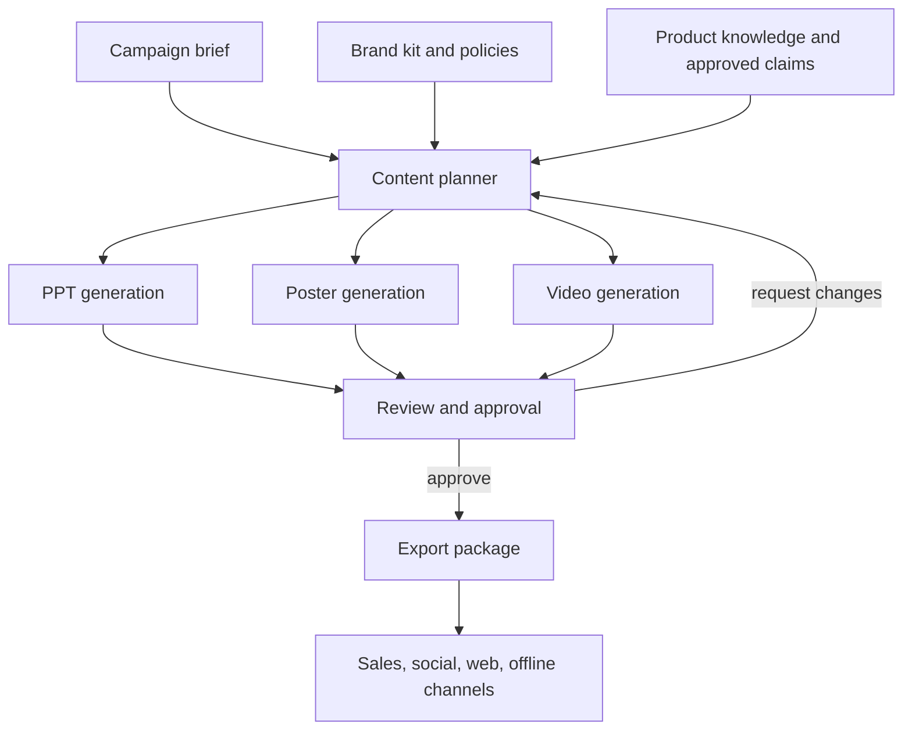

# Marketing Module Architecture Plan

## 1. Objective

Add a marketing operations module to the existing Volt GUI workbench. The new module turns campaign briefs, brand assets, and product knowledge into reviewable marketing deliverables without replacing the current Work and Code experiences:

- PPT generation for sales decks, roadshow decks, proposals, and internal campaign reviews.
- Business poster generation for social channels, store pages, offline flyers, and campaign banners.
- Marketing video generation for short ads, product teasers, launch explainers, and sales enablement clips.

The module should appear as an additional workbench capability inside Volt GUI. Existing chat, Work mode, Code mode, providers, tools, sessions, memory, and resource screens remain intact. Heavyweight generation, rendering, asset storage, and approval workflows stay outside the existing local-first Go core.

## 2. Primary Users

| User | Need | Success Signal |
| --- | --- | --- |
| Marketing operator | Produce campaign materials from a brief and brand kit | First usable draft in minutes, not hours |
| Brand reviewer | Enforce brand, legal, and channel constraints | Review comments map to exact slides, images, scenes, and claims |
| Sales / regional team | Adapt approved assets for local audiences | Variants preserve approved claims and visual identity |
| Admin / ops | Govern models, templates, assets, and cost | Generation jobs are observable, retryable, and auditable |

## 3. Scope

### In Scope for the New Module

- Campaign workspace: brief, target audience, product facts, references, required channels, due date, and approval state.
- Brand kit: logos, colors, fonts, tone rules, banned claims, disclaimers, channel-safe templates.
- Template library: PPT templates, poster layouts, video storyboard structures, aspect ratios, CTA patterns.
- Multi-format generation: PPT, poster, and video workflows with shared planning and asset reuse.
- Human review loop: compare versions, comment, request regeneration for a selected section, approve, export.
- Job orchestration: queued generation tasks, status tracking, retries, cancellation, cost accounting.
- Asset governance: source files, generated intermediates, final exports, metadata, rights, and lineage.

### Out of Scope for MVP

- Full DAM replacement.
- Fully autonomous campaign launch without human approval.
- Native non-linear video editor.
- Public multi-tenant SaaS billing unless explicitly productized later.

## 4. Product Workflow

## 5. Additive Integration Boundary

Volt GUI remains the operator-facing desktop workbench and local agent host. The marketing capability is added as a new module within the existing workbench, exposed through stable APIs and plugin/tool contracts. It must not remove or redefine the current Work and Code activity modes.

| Boundary | Responsibility |
| --- | --- |
| Volt GUI desktop | Existing Work/Code workbench plus a new Marketing entry, campaign UI, local file import, previews, review actions, model/tool invocation surface |
| Marketing Hub API | Campaign, asset, template, review, and export contracts |
| Orchestration service | Job graph, queue dispatch, retries, cancellation, status, cost accounting |
| Generation workers | PPT composition, image/poster generation, video storyboard/render pipeline |
| Asset store | Original uploads, generated assets, thumbnails, exports, provenance metadata |
| Policy service | Brand rules, legal claims, safety checks, channel constraints |
| External AI/render providers | LLM, image model, video model, speech/music, rendering engine, stock media search |

## 6. Container Architecture

See [marketing-hub-components.mmd](./marketing-hub-components.mmd) for the Mermaid source.

## 6.1 Module Placement in Existing Workbench

The marketing module is an additive surface in the existing desktop workbench.

| Existing Surface | New Marketing Addition | Rule |
| --- | --- | --- |
| Primary sidebar | Add `Marketing` as a new activity/resource entry beside existing Work and Code navigation | Do not merge Marketing with Code mode or replace Work dashboard |
| Main stage | Campaign dashboard, campaign detail, artifact preview, review queue | Main stage chooses the active surface; existing chat/session surfaces remain available |
| Composer | Marketing-aware prompt context when a campaign is active | Existing slash commands, attachments, and `@` references continue to work |
| Right dock | Campaign context, brand kit, source assets, generation job trace, policy findings | Reuse the existing dock pattern instead of inventing a separate inspector shell |
| Resource surfaces | `campaigns`, `brandKits`, `marketingTemplates`, `marketingAssets`, `generationJobs`, `reviews`, `exports` | Add typed resources to the existing data-provider pattern |
| Tool/plugin system | Marketing generation tools and provider adapters | Register as tools/plugins; do not hardcode provider-specific logic into the desktop shell |

Recommended first navigation model:

1. Keep `Work` and `Code` activity modes unchanged.
2. Add a `Marketing` sidebar section under Work-oriented resources, or promote it to a third activity mode only after the module has enough daily usage to justify mode-level status.
3. Store campaign threads as normal sessions with campaign metadata, so chat and artifact work stay connected.
4. Let users start generation from either a campaign page or an agent conversation, but both paths create the same `generationJob` resource.

### 6.2 Desktop Workbench

- Create and edit campaign briefs.
- Import local files and references into a campaign.
- Show job state and generated previews.
- Provide targeted regeneration controls, for example regenerate slide 3, poster headline, or scene 2 voiceover.
- Export approved packages to local disk.

### 6.3 Marketing Hub API

- Owns stable REST contracts for campaigns, briefs, brand kits, templates, jobs, reviews, and exports.
- Applies authentication and authorization.
- Exposes idempotent job creation so UI retries do not duplicate expensive generation.
- Returns signed upload/download URLs for large files rather than proxying binaries through normal JSON APIs.

### 6.4 Workflow Orchestrator

- Converts one generation request into a DAG of tasks.
- Enforces dependencies: outline before deck, storyboard before video render, policy checks before final export.
- Tracks job state: queued, running, waiting_for_review, failed, canceled, approved, exported.
- Uses at-least-once queue delivery; every worker operation must be idempotent by job step id.

### 6.5 PPT Worker

- Generates deck outline, slide narrative, speaker notes, chart suggestions, and visual slots.
- Fills a chosen template using a PPTX renderer.
- Runs layout checks for overflow, missing fonts, broken image references, and slide count limits.
- Produces editable `.pptx`, preview images, and a structured slide manifest.

### 6.6 Poster Worker

- Produces layout plan, copy variants, image prompts, and composition metadata.
- Generates or selects visual assets, then places text, logo, CTA, QR code, and disclaimers using deterministic layout rules.
- Produces PNG/JPEG/PDF exports and editable source metadata.
- Validates channel-specific dimensions and safe areas.

### 6.7 Video Worker

- Converts brief into script, storyboard, shot list, voiceover plan, captions, and music direction.
- Generates clips through provider APIs or renders scenes from templates.
- Assembles timeline with transitions, captions, logo, CTA, and audio mix.
- Produces MP4, thumbnails, subtitles, storyboard manifest, and source package.

### 6.8 Policy and Review

- Checks brand color/font/logo usage, banned phrases, required disclaimers, and claim evidence.
- Produces reviewable findings attached to exact artifact coordinates: slide id, layer id, scene id, timestamp, or text span.
- Blocks final approval when required checks fail.

### 6.9 Artifact Review UX Patterns

Marketing artifacts need an inspection surface that works across PPT, poster, and video without turning Volt GUI into a format-specific editor. The first implementation should treat the desktop as an artifact review and approval workbench, while generation workers and format-native editors own heavyweight rendering and deep editing.

#### Review Canvas

The main-stage preview should use a review canvas whenever an artifact has more structure than a single static file. The canvas is shared by deck slides, poster variants, storyboard frames, and video scenes.

Required behavior:

- Keep the canvas independent from the conversation or job thread panel so users can inspect artifacts while the generation trace remains visible.
- Provide explicit select and pan modes. Select mode should open artifact details or comments; pan mode should move the canvas without accidentally activating artifact controls.
- Provide bounded zoom, fit-to-screen, center, and reset controls. Disabled states should be visible when the current view cannot zoom further or has no pan offset to reset.
- Provide quick jumps to reviewable stages such as copy, draft, design, and export when those stages exist for the artifact.
- Keep controls keyboard reachable and labelled. Canvas buttons should use icons with accessible titles instead of text-heavy command pills.
- Persist reviewer decisions, comments, and selected regions as artifact coordinates. Treat viewport pan and zoom as local UI state unless product requirements later need shared review playback.

Non-goals for MVP:

- Do not implement a full PPT, poster, or video editor inside the core desktop shell.
- Do not hardcode a PPT-only canvas or generation flow into the generic workbench.
- Do not require all artifact formats to share identical visual layouts; they only need the same control contract and review state model.

#### Style Gate

The generation flow should expose style or template choice as a user-reviewable checkpoint before expensive final rendering or export.

Required behavior:

- Present style, template, or visual-direction options as a job step that can be approved, changed, or sent back to the previous draft/content stage.
- Record the selected style id, template version, brand kit version, and reviewer identity in the job or review record.
- In manual mode, block final design generation until the user chooses and approves a style option.
- In autopilot mode, allow the worker to select a recommended style, but still surface the choice and rationale before final export.
- Let users return from the style gate to the draft/content stage without discarding the whole campaign job.
- Show downstream export readiness only after the selected style has been applied and policy checks have passed.

Acceptance criteria:

- A reviewer can inspect a generated deck, poster, or storyboard with pan, zoom, fit, center, reset, and stage-jump controls.
- A reviewer can approve a style choice or return to the prior stage before final rendering.
- Review comments and policy findings can point to exact artifact coordinates independent of the current viewport.
- The generic workbench code remains provider-neutral and format-neutral; format-specific generation logic stays in plugins, workers, or provider adapters.

## 7. Core Data Model

| Entity | Owns | Notes |
| --- | --- | --- |
| Campaign | Brief, audience, product, channels, status | Root aggregate for all artifacts |
| BrandKit | Logo, palette, font, tone, constraints | Versioned; artifacts reference the exact version used |
| Template | Format, layout schema, channel profile | Separate editable template source from published template version |
| Asset | Binary object metadata and provenance | Original, generated, licensed, rendered, exported |
| Artifact | PPT/poster/video logical output | Has versions and review state |
| Job | Workflow execution state | Idempotency key, DAG steps, provider cost, logs |
| Review | Comments, approvals, policy findings | Must preserve reviewer and timestamp |
| ExportPackage | Final downloadable bundle | Immutable after creation |

## 8. API Sketch

Use REST as the default because the workflow is resource-oriented, simple to debug, and easy to expose through desktop bindings. The desktop should wrap these endpoints through the same typed service/data-provider style used by existing resource surfaces.

| Method | Path | Purpose |
| --- | --- | --- |
| `POST` | `/campaigns` | Create campaign from a brief |
| `GET` | `/campaigns/{id}` | Fetch campaign state |
| `POST` | `/campaigns/{id}/assets` | Create upload session for source assets |
| `POST` | `/campaigns/{id}/generation-jobs` | Start PPT/poster/video generation |
| `GET` | `/jobs/{id}` | Poll job status and step progress |
| `POST` | `/artifacts/{id}/regenerate` | Regenerate selected slide, region, scene, or text span |
| `POST` | `/artifacts/{id}/reviews` | Add comments or approval decisions |
| `POST` | `/artifacts/{id}/exports` | Create final export package |
| `GET` | `/exports/{id}/download` | Fetch signed download URL |

Job creation should require an `Idempotency-Key` header. Large assets should use pre-signed object storage URLs.

## 9. Generation Pipeline

### Shared Planning Layer

All formats start from a shared campaign plan:

1. Normalize the brief into objective, audience, offer, proof points, channels, constraints, and CTA.
2. Retrieve approved product facts, claims, disclaimers, and brand rules.
3. Generate a campaign narrative: message hierarchy, tone, content modules, required evidence.
4. Split the narrative into format-specific manifests.

### PPT Pipeline

1. Deck strategy and outline.
2. Slide-by-slide content manifest.
3. Layout selection from template slots.
4. Visual asset selection or generation.
5. PPTX render and preview rasterization.
6. Layout, policy, and claim checks.

### Poster Pipeline

1. Channel and aspect-ratio selection.
2. Copy variants and visual direction.
3. Image generation or asset selection.
4. Deterministic text/logo/CTA composition.
5. Export and safe-area checks.

### Video Pipeline

1. Storyboard, script, voiceover, and scene manifest.
2. Clip generation or scene template rendering.
3. Timeline assembly, captions, audio, and CTA.
4. MP4 render, thumbnail generation, subtitle export.
5. Policy, rights, and duration checks.

## 10. Non-Functional Requirements

| Area | Requirement |
| --- | --- |
| Reliability | Generation jobs are resumable by step; failed steps can retry without duplicating completed artifacts |
| Cost control | Track provider, model, tokens, render seconds, storage, and retry cost per campaign |
| Latency | MVP target: first PPT/poster preview under 3 minutes; first video preview under 15 minutes depending on provider |
| Auditability | Every final artifact records prompt inputs, template version, brand kit version, model/provider, and reviewer decisions |
| Security | Object URLs are time-limited; workspace access is scoped by campaign and role |
| Compliance | Policy checks are required before final export; human approval is required for externally published assets |
| Portability | Provider adapters isolate model/render vendors so the hub can switch image/video/PPT engines |

## 11. MVP Delivery Plan

### Phase 0: Additive Module Contract

- Finalize campaign, artifact, job, and review schemas.
- Define brand kit and template manifest formats.
- Pick the first renderer/provider set for PPT, image, and video.
- Create a static UI prototype that adds Marketing navigation and campaign surfaces without replacing existing Work/Code screens.

### Phase 1: PPT and Poster MVP

- Campaign brief intake and asset upload.
- Brand kit and template selection.
- PPT generation with editable PPTX output and slide previews.
- Poster generation with PNG/PDF output and review comments.
- Job status polling, retry, cancellation, and export package.

### Phase 2: Video MVP

- Script and storyboard generation.
- Clip generation through provider adapter.
- Timeline assembly, captions, thumbnail, MP4 export.
- Duration, subtitle, and rights metadata checks.

### Phase 3: Governance and Scale

- Versioned template publishing workflow.
- Approval rules by channel and market.
- Cost budgets and provider routing policy.
- Searchable campaign history and asset reuse.

## 12. Risks and Mitigations

| Risk | Impact | Mitigation |
| --- | --- | --- |
| Output quality varies by provider | Review cycles become slow | Use manifests, deterministic layout, template constraints, and targeted regeneration |
| Brand/legal violations | Assets cannot be safely published | Make policy checks blocking before final export and attach findings to exact locations |
| Video generation is slow and expensive | Poor UX and cost overruns | Queue video jobs separately, expose progress, cap variants, and use storyboard approval before render |
| PPT layout overflow | Generated decks look unprofessional | Render previews, run text overflow checks, and keep template slots constrained |
| Vendor lock-in | Provider cost or quality changes hurt roadmap | Use provider adapters and store normalized artifact manifests |
| Desktop app becomes too heavy | Existing Volt GUI scope drifts | Keep heavyweight workers service-side and expose capabilities via stable APIs/tools |
| Marketing module disrupts existing Work/Code flows | Current users lose muscle memory | Add navigation and resources incrementally; keep Work and Code modes unchanged |

## 13. Open Questions

- Should Marketing start as a Work-mode resource section or become a third top-level activity mode after validation?
- Is this module for internal single-organization use first, or a multi-tenant product?
- Which channels must be supported at launch: WeChat, Douyin, Xiaohongshu, sales PDF, web banners, offline print?
- Which provider family is allowed for image and video generation, and what data can leave the organization?
- Should editable poster/video source be preserved in a third-party design format or a first-party JSON manifest?
- Does approval require legal sign-off, brand sign-off, regional sign-off, or all three?
